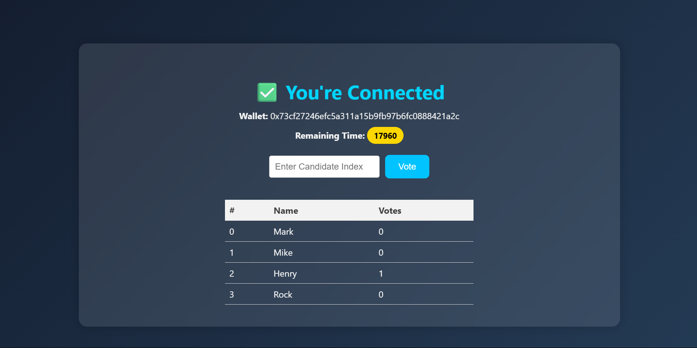
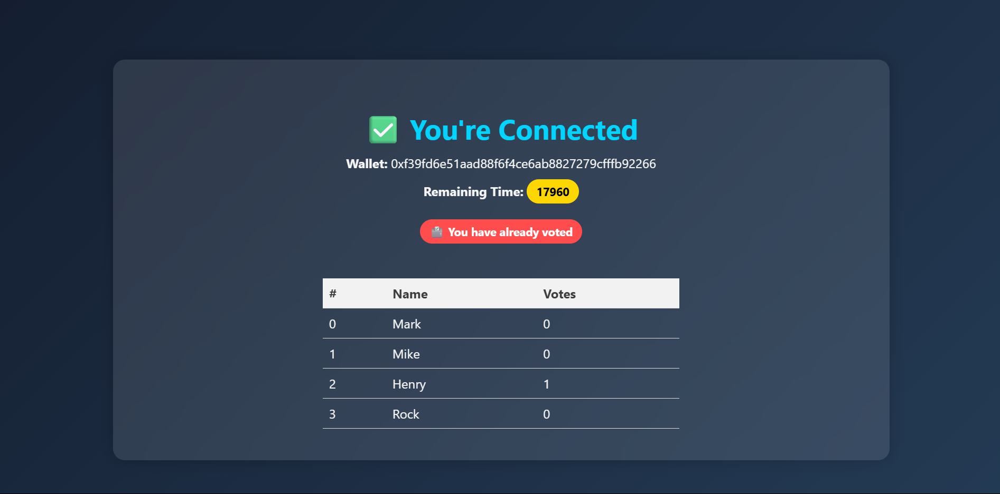

# 🗳️ Decentralized Voting DApp
### 🖼️ Screenshots

#### 🔐 Login Page


#### ✅ After Login Page


#### 📊 After Vote 


A simple decentralized voting application built with **React** for frontend and **Hardhat** for local Ethereum blockchain development. Users can vote securely via MetaMask, and results are stored and read from the blockchain.

---

## 🚀 Features

- Login with MetaMask
- Vote for a candidate by index
- Real-time candidate vote counts
- Prevents double voting
- Runs on local Hardhat blockchain

---

## 🛠️ Technologies Used

- React.js
- Hardhat (Ethereum development environment)
- Ethers.js
- Solidity (for smart contract)
- MetaMask (for wallet connection)

---

## 📦 Installation & Setup

### 1. Clone the repository

```bash
git clone https://github.com/your-username/voting-Dapp.git
cd voting-Dapp

After you cloned the repository, you want to install the packages using

```shell
npm install
```

You first need to compile the contract and upload it to the blockchain network. Run the following commands to compile and upload the contract.

```shell
npx hardhat compile
npx hardhat run --network localhost scripts/deploy.js
```

Once the contract is uploaded to the blockchain, copy the contract address and copy it in the .env file. You can also use another blockchain by writing the blockchain's endpoint in hardhat-config.

Once you have pasted your private key and contract address in the .env file, simply run command

```shell
npm start
```
